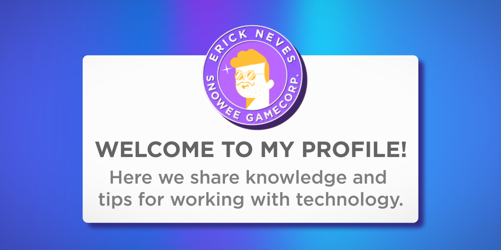

### <h1>:wave: WHO AM I :wave:</h1>

I'm Erick Neves, graduated in Digital Games, working as an Automation and Performance Analyst, and I want to share the best of myself with the world.

## Education :book:

I'm Full Stack Developer Focused in Java | Angular 🤓

Bootcamp Generation Brazil - Java Full Stack Developer 💻

FATEC - Faculdade de Tecnologia - Jogos Digitais 💻

## Contact :grin:

You can find me here <a href="https://snoweegamecorp.com/">snoweegamecorp.com</a>

## My Skills :zap:

## Github Stats :octocat:

<table>
  <tr>
    <td></td>
    <td></td>
  </tr>  
</table>

